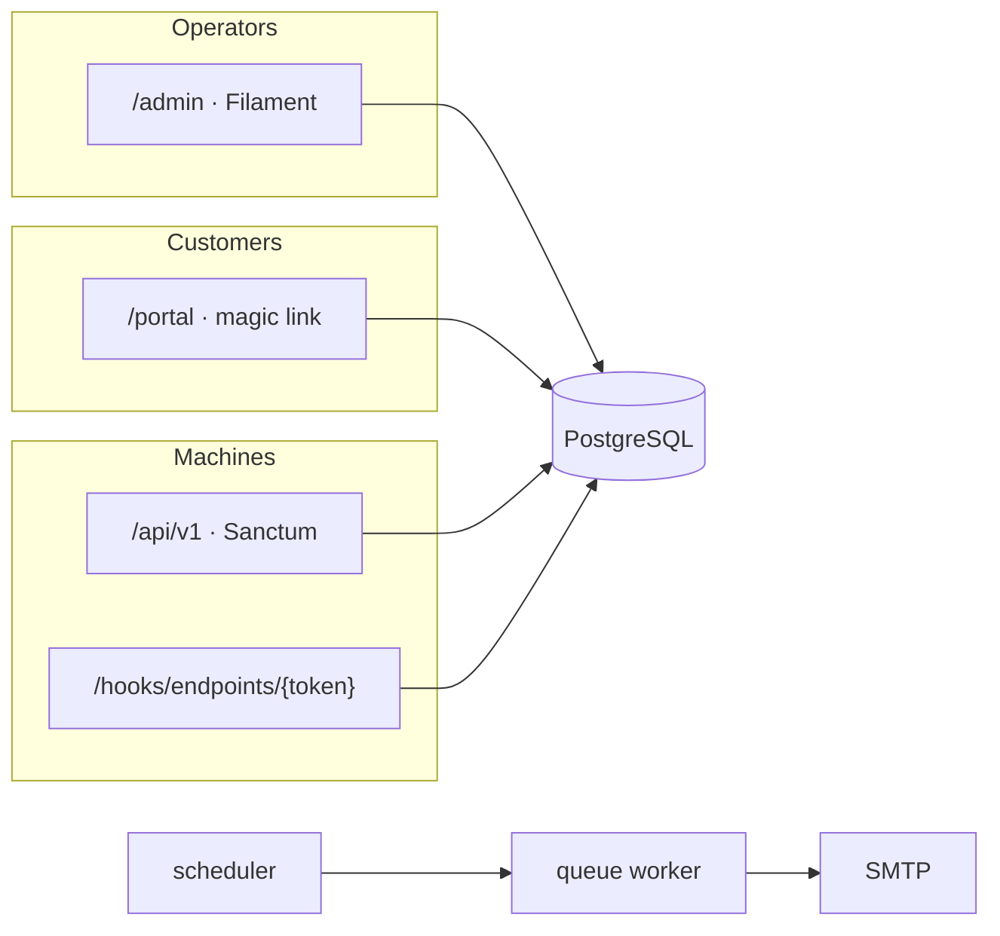

# MSP Platform

Self-hosted operations platform for **Managed Service Providers**.

Track recurring contracts and licenses, see your real margin, get reminded
before something renews or a certificate expires, and give customers a portal
for their own services. White-label: you name it, you brand it.

**Laravel 13 · Filament 4 · PHP 8.4 · PostgreSQL 16 · Docker**
[MIT license](LICENSE)

The operator UI is **English-native**. Missing strings fall back to **English**.
The interface follows the browser language, with a switcher on login and in
admin. Branding (name, logo, color) is yours.

---

## What this is

A small MSP’s **recurring-work** system:

| You manage | The platform does |
|---|---|
| Customers, contacts, vendors, catalog | Portfolio of contracts & licenses with cost / sale / margin |
| Renewal & notice dates | Dashboard widgets + staff mail + optional customer mail |
| Moves, migrations, on-site work | Planning board with customer, deadline, assignee, and reminders |
| Certificates & hostnames | Per-endpoint webhook (e.g. Uptime Kuma) or a manual expiry |
| SEPA collection (optional Stripe) | Customer portal with magic-link login and iDEAL → SEPA |
| Integrations | JSON Agent API (`/api/v1`) + optional MCP sidecar |

Nothing is vendor-locked. First boot asks for an admin account and a platform
name. Mail, Stripe, tokens, logo and color are all set (and reset) from
**System** — no tinker, no baked-in company name.

## What this is not

On purpose. Do not expect these; they are different products:

- **Not a PSA** — no tickets, time tracking, or projects
- **Not an RMM** — no agents on customer machines
- **Not a CMDB** — no servers, racks, or CI graphs
- **Not invoicing / quoting** — you do not send invoices or offers from here
  (Stripe collection in the portal is optional, for customers who already have
  a contract)

If a date comes back every year (or every month), it belongs here.

---

## Languages

English is the source language **and** the fallback (`APP_LOCALE=en`,
`APP_FALLBACK_LOCALE=en`). Adding a language later does not require rewriting
the UI.

Resolution order:

1. Language switcher cookie (`msp.locale`)
2. Browser `Accept-Language`
3. `APP_LOCALE` (default `en`)
4. English

| Code | Language |
|------|----------|
| `en` | English (default / fallback) |
| `nl` | Dutch |
| `de` | German |
| `fr` | French |
| `es` | Spanish |
| `it` | Italian |
| `pt` | Portuguese |
| `da` | Danish |
| `sv` | Swedish |
| `fi` | Finnish |
| `pl` | Polish |
| `el` | Greek |
| `tr` | Turkish |

Switcher: login screen and admin top bar. Translations live in `lang/{code}.json`
(English keys → translated strings). To add a locale: register it in
`app/Support/LocaleCatalog.php` and add the JSON file.

---

## Features

**Contracts & catalog**
- Customers, contacts, vendors, products, purchase bundles
- Filters, search, CSV export
- Computed margin and annualised revenue (not stored)

**Renewals**
- One-click renew or cancel
- Notice-deadline widget
- Failed Stripe collections on the dashboard
- Customer reminder mail, on/off **per customer** and **per contract**

**Endpoints (certificates / domains)**
- Own webhook URL per endpoint (Uptime Kuma or generic JSON)
- Or a date you type yourself
- Notices at 30 / 14 / 7 / 1 days and once when expired — each toggle per endpoint
- See [docs/ENDPOINTS.md](docs/ENDPOINTS.md)

**Planning**
- Tasks for upcoming moves, migrations, on-site jobs, and internal projects
- Customer, deadline, type, status, priority, assignee, from/to locations
- Dashboard widget for open work in the next 60 days (overdue included)
- CSV export; also on the Agent API and MCP sidecar

**Portal & billing**
- Magic-link login for contacts (`/portal`)
- Customers see their services and prices — never cost, margin, or license keys
- Optional automatic collection via Stripe (iDEAL → SEPA)

**Operations**
- Roles: `admin`, `manager`, `sales`, `viewer` (viewer is read-only, including catalog)
- Optional TOTP 2FA (can be required)
- Audit log
- Demo data you can load and wipe in one click
- Sign-in lockout: 5 failures / 15 minutes, per IP and per email
- 13 interface languages; switcher on login and in the admin top bar

**Integrations**
- Sanctum Agent API — [AGENT.md](AGENT.md), [openapi/agent-api.yaml](openapi/agent-api.yaml)
- MCP sidecar — [mcp/README.md](mcp/README.md)

---

## Demo login

There is **no default login** on a normal install. Registration closes after the
first administrator.

For a public demo instance, set `APP_DEMO_LOGIN=true` in `.env` (or run
`php artisan demo:seed --login` on an empty database). Credentials — documented
here, not shown on the login card:

| | |
| --- | --- |
| Username | `test` |
| Password | `test` |

That account is **view-only**. Creating a real administrator removes it
automatically and closes registration.

## Quick start (Docker)

Requires Docker Compose. Default URL: [http://localhost:8090](http://localhost:8090)

```bash
git clone https://github.com/tavbuilds/OpenMSP.git
cd OpenMSP
cp .env.example .env
```

Set at least:

```env
APP_URL=http://localhost:8090
APP_LOCALE=en
APP_FALLBACK_LOCALE=en
DB_CONNECTION=pgsql
DB_HOST=db
DB_PORT=5432
DB_DATABASE=msp
DB_USERNAME=msp
DB_PASSWORD=secret
```

Then:

```bash
docker compose build
docker compose up -d
docker compose exec app php artisan key:generate   # local only; never on an existing production volume
docker compose exec app php artisan migrate
```

Open `/admin`:

1. Create the first **admin** account (this screen exists only while `users` is empty).
2. Finish **onboarding**: platform name, color, logo; optionally mail, Stripe, an API token.
3. Optional: **System → Demo data** to load sample customers (and wipe them later).

There is **no default login**. Existing installs skip the wizard; you can re-run
it from settings. Details: [docs/ONBOARDING.md](docs/ONBOARDING.md).

### Tests

```bash
docker compose exec app php artisan test
```

---

## Production

Use [docker-compose.prod.yml](docker-compose.prod.yml) (image-baked, migrates on
boot). **Same file** for Docker CLI, Coolify, Portainer, or a DigitalOcean
droplet. Env list: [`.env.production.example`](.env.production.example).
Walkthrough: [DEPLOY.md](DEPLOY.md).

Before you go live:

1. `APP_ENV=production`, `APP_DEBUG=false`, a **stable** `APP_KEY` — see [docs/SECRETS.md](docs/SECRETS.md)
2. Strong `DB_PASSWORD`. Secrets in env or the UI, never in Git
3. HTTPS in front of the stack
4. Working SMTP (magic links and reminders)
5. Database backups

`APP_KEY` encrypts license keys, 2FA secrets, and UI-stored SMTP/Stripe
secrets. Generate it **once** and keep it. Rotating it on a live volume makes
that ciphertext unreadable.

---

## Architecture



| Container | Role |
|-----------|------|
| `web` | Nginx on host port **8090** |
| `app` | PHP-FPM 8.4 (Laravel + Filament) |
| `db` | PostgreSQL 16 |
| `queue` | `queue:work` — mail and notifications |
| `scheduler` | Laravel scheduler (daily reminders at 08:00 in `APP_TIMEZONE`) |

Domain: `Company` → `Contract` ← `Product` / `Vendor`. `Endpoint` is optional
and may be internal (no customer). Margins (`margin_eur`, `margin_pct`) and
`annual_revenue` are computed.

### Roles

| Role | Read | Create / edit contracts | Delete, users, settings |
|------|------|-------------------------|-------------------------|
| `viewer` | yes | no | no |
| `sales` | yes | yes | no |
| `manager` | yes | yes | yes |
| `admin` | yes | yes | yes |

The last administrator cannot be deleted or demoted.

---

## Security

- Passwords hashed, CSRF, Eloquent (no ad-hoc SQL)
- License keys and UI secrets encrypted with `APP_KEY`
- Role checks in the panel and the API
- Webhook URLs are unguessable per endpoint; unknown token → 404
- Audit log (tokens redacted)
- Sign-in lockout after 5 failures (15 minutes), per IP and per email
- Registration closed after the first real administrator

---

## Documentation

| Doc | Contents |
|-----|----------|
| [docs/ONBOARDING.md](docs/ONBOARDING.md) | First boot, settings, reset |
| [DEPLOY.md](DEPLOY.md) | Portainer / production compose |
| [docs/SECRETS.md](docs/SECRETS.md) | `APP_KEY`, SMTP, Stripe, 2FA |
| [docs/PORTAL.md](docs/PORTAL.md) | Customer portal and collection |
| [docs/ENDPOINTS.md](docs/ENDPOINTS.md) | Certificates, webhooks, notice toggles |
| [AGENT.md](AGENT.md) | JSON API for agents |
| [SECURITY.md](SECURITY.md) | How to report vulnerabilities |
| [CONTRIBUTING.md](CONTRIBUTING.md) | Branch workflow (`feature/*` → `dev` → `main`) |

---

## Contributing

Work starts from `dev`, not `main`. Open a PR into `dev`; releases are `dev` →
`main`. Keep the product vendor-neutral. See [CONTRIBUTING.md](CONTRIBUTING.md).

## License

[MIT](LICENSE) — use it, fork it, white-label it.
