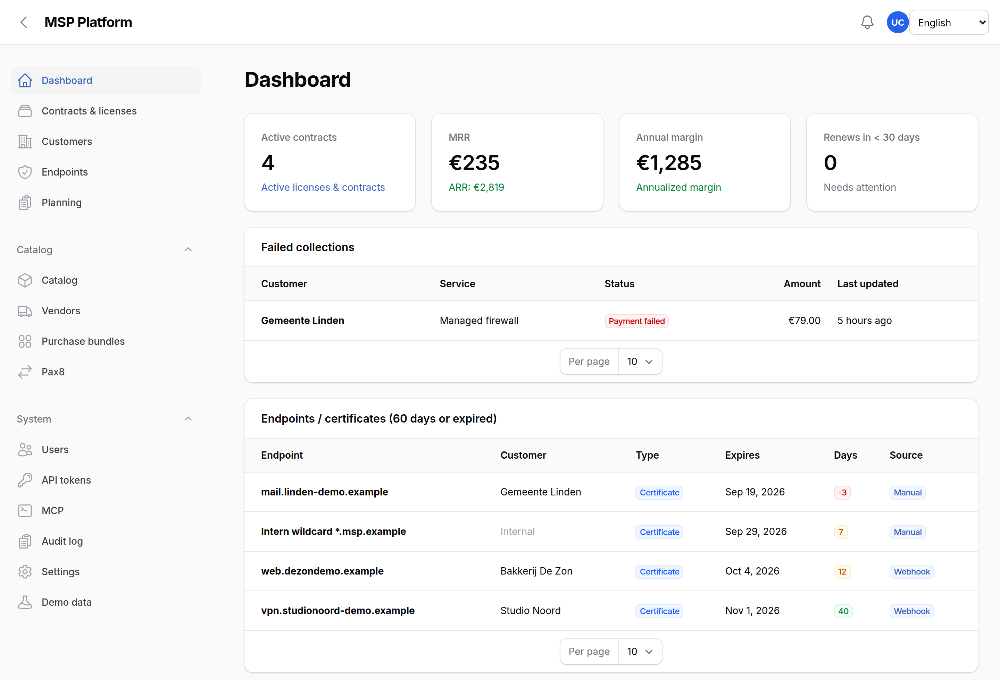
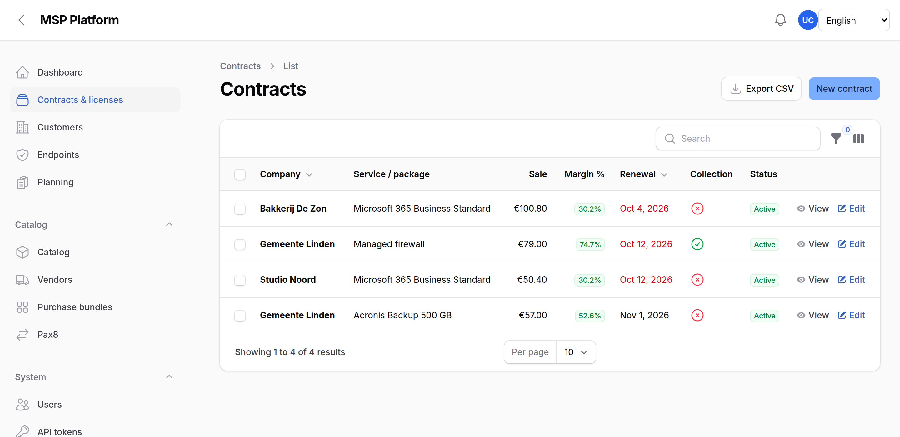
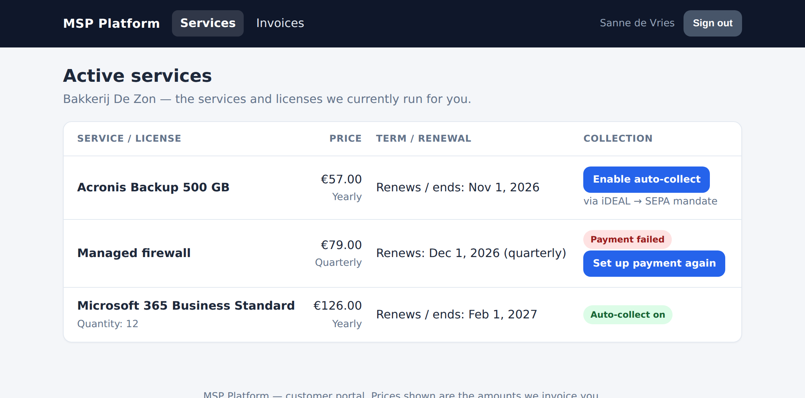
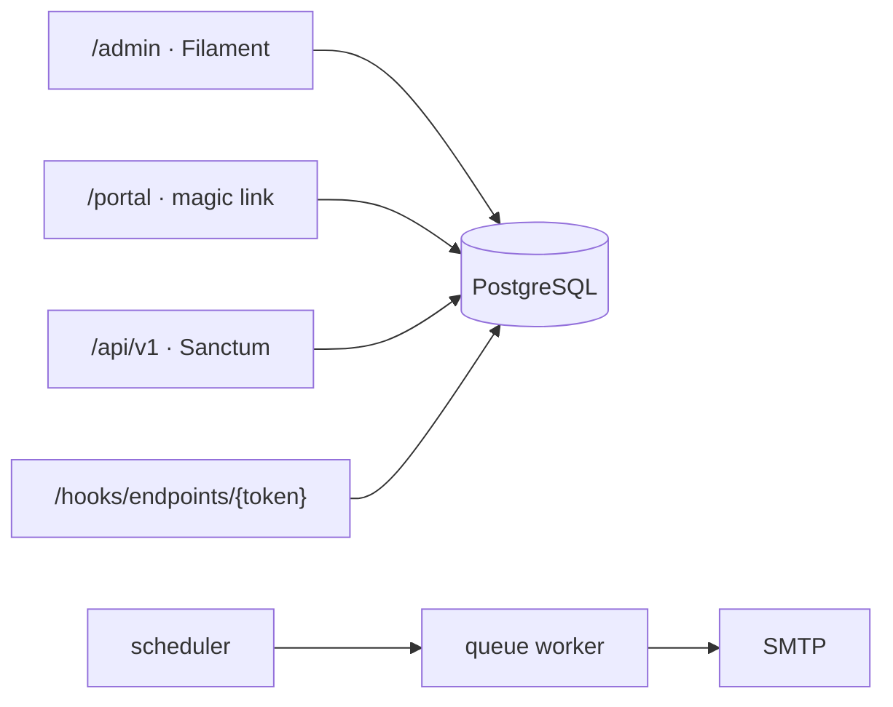

<div align="center">

# 🔁 OpenMSP

**The recurring-work system for Managed Service Providers.**

Contracts, licenses, renewals and certificates — with the margin sitting right next to them.
Self-hosted, white-label, no vendor lock-in.

[](https://demo.openmsp.eu)
[](LICENSE)


</div>



---

## 💡 The idea

> **If a date comes back every year, it belongs here.**

Most MSPs track renewals in a spreadsheet until the day a €4,000 contract
silently rolls over. OpenMSP is the small, boring system that stops that —
and shows you what you actually earn on each line.

|  |  |  |
| :--: | :-- | :-- |
| 📦 | **Contracts & catalog** | Customers, contacts, vendors, products, purchase bundles — with cost, sale and computed margin |
| ⏰ | **Renewals** | Notice deadlines and upcoming renewals on the dashboard, plus reminder mail to staff and (optionally) the customer |
| 🔐 | **Certificates** | A webhook per endpoint (Uptime Kuma or generic JSON), or a date you type. Alerts at 30 / 14 / 7 / 1 days |
| 🗓️ | **Planning** | Moves, migrations and on-site work with deadline, assignee and reminders |
| 🧾 | **Customer portal** | Magic-link login. Customers see their services and prices — never your cost, margin or license keys |
| 🤖 | **Built for agents** | JSON API at `/api/v1` and a built-in MCP server at `/mcp` |

<table>
<tr>
<td width="50%"></td>
<td width="50%"></td>
</tr>
<tr>
<td align="center"><em>Margin per line, not per invoice</em></td>
<td align="center"><em>What your customer sees</em></td>
</tr>
</table>

### 🚫 What it deliberately isn't

**Not a PSA** (no tickets or time tracking) · **not an RMM** (no agents on
customer machines) · **not a CMDB** (no racks or CI graphs) · **not invoicing**
(Stripe collection in the portal is optional, for contracts you already have).

---

## 🎬 Try it

Poke at the real thing — no install:

**[demo.openmsp.eu](https://demo.openmsp.eu)** · username `test` · password `test`

That account is **view-only** and the data resets. On your own install there is
**no default login at all** — the first screen creates your administrator and
registration closes behind you. Running your own public demo? Set
`APP_DEMO_LOGIN=true`.

## 🚀 Run it

Docker Compose, roughly two minutes:

```bash
git clone https://github.com/tavbuilds/OpenMSP.git
cd OpenMSP
cp .env.example .env            # set APP_URL + DB_* (see .env.example)

docker compose build
docker compose up -d
docker compose exec app php artisan key:generate   # new installs only ⚠️
docker compose exec app php artisan migrate
```

Open **<http://localhost:8090/admin>**: the first screen creates your
administrator, then a short wizard brands the platform and optionally wires up
mail, Stripe and an API token. Want something to look at? **System → Demo data** loads a sample
portfolio and wipes it again in one click.

```bash
docker compose exec app php artisan test   # 141 tests
```

---

## 🔌 For machines

| | |
|---|---|
| **Agent API** | `GET {APP_URL}/api/v1/...` with a Sanctum bearer token → [AGENT.md](AGENT.md) · [OpenAPI spec](openapi/agent-api.yaml) |
| **MCP server** | `{APP_URL}/mcp`, built in — OAuth or bearer. Set it up under **System → MCP** → [mcp/README.md](mcp/README.md) |
| **Webhooks** | One unguessable URL per endpoint for certificate monitors → [docs/ENDPOINTS.md](docs/ENDPOINTS.md) |

---

<a id="languages"></a>

<details>
<summary><b>🌍 13 languages</b> — English-native, switcher on login and in the top bar</summary>

<br>

English is the source language **and** the fallback, so a missing string never
shows a blank.

`en` `nl` `de` `fr` `es` `it` `pt` `da` `sv` `fi` `pl` `el` `tr`

Resolution order: switcher cookie (`msp_locale`) → browser `Accept-Language` →
`APP_LOCALE` → English.

Translations live in `lang/{code}.json`, keyed by the English string. To add a
language: register the code in `app/Support/LocaleCatalog.php` and drop in the
JSON file. A test fails the build if any locale is missing a string.

</details>

<details>
<summary><b>🏗️ Architecture</b> — five containers, one database</summary>

<br>



| Container | Role |
|-----------|------|
| `web` | Nginx on host port **8090** |
| `app` | PHP-FPM 8.4 (Laravel + Filament) |
| `db` | PostgreSQL 16 |
| `queue` | `queue:work` — mail and notifications |
| `scheduler` | Daily reminders at 08:00 in `APP_TIMEZONE` |

Domain: `Company` → `Contract` ← `Product` / `Vendor`. An `Endpoint` may be
internal (no customer). Margin and annual revenue are computed, never stored.

Renewal watching covers **quarterly and yearly** contracts: a monthly contract
can be cancelled every month, so its renewal is not a deadline.

</details>

<details>
<summary><b>🔒 Roles &amp; security</b></summary>

<br>

| Role | Read | Create / edit contracts | Delete, users, settings |
|------|:----:|:----:|:----:|
| `viewer` | ✅ | — | — |
| `sales` | ✅ | ✅ | — |
| `manager` | ✅ | ✅ | ✅ |
| `admin` | ✅ | ✅ | ✅ |

The last administrator cannot be deleted or demoted.

- License keys, 2FA secrets and UI-stored SMTP/Stripe secrets are encrypted with `APP_KEY`
- Optional TOTP 2FA, which you can make mandatory
- Sign-in lockout after 5 failures in 15 minutes, per IP **and** per email
- Audit log, with tokens redacted
- Webhook URLs are unguessable per endpoint; an unknown token returns 404
- Registration closes after the first real administrator

Report a vulnerability: [SECURITY.md](SECURITY.md).

</details>

<details>
<summary><b>🏭 Going to production</b></summary>

<br>

Use [docker-compose.prod.yml](docker-compose.prod.yml) — the same file works for
Docker CLI, Coolify, Portainer or a plain droplet. Walkthrough:
[DEPLOY.md](DEPLOY.md) · env list: [.env.production.example](.env.production.example).

Before you go live:

1. `APP_ENV=production`, `APP_DEBUG=false`, and a **stable** `APP_KEY`
2. A strong `DB_PASSWORD`; secrets in env or the UI, never in Git
3. HTTPS in front of the stack
4. Working SMTP — magic links and reminders depend on it
5. Database backups

> ⚠️ **`APP_KEY` is not rotatable in place.** It encrypts license keys, 2FA
> secrets and UI-stored credentials. Generate it once, keep it safe; rotating it
> on a live volume makes that ciphertext unreadable. See [docs/SECRETS.md](docs/SECRETS.md).

</details>

---

## 📚 Docs

[Onboarding](docs/ONBOARDING.md) · [Deploy](DEPLOY.md) · [Secrets](docs/SECRETS.md) · [Portal](docs/PORTAL.md) · [Endpoints](docs/ENDPOINTS.md) · [Agent API](AGENT.md) · [Security](SECURITY.md) · [Contributing](CONTRIBUTING.md)

## 🤝 Contributing

Branch from `dev`, open a PR into `dev`. Maintainers promote `dev` → `staging` →
`main`. Keep it vendor-neutral — no customer names in UI, MCP or docs.
Details in [CONTRIBUTING.md](CONTRIBUTING.md).

## ⚖️ License

[MIT](LICENSE) — use it, fork it, white-label it, sell it.
